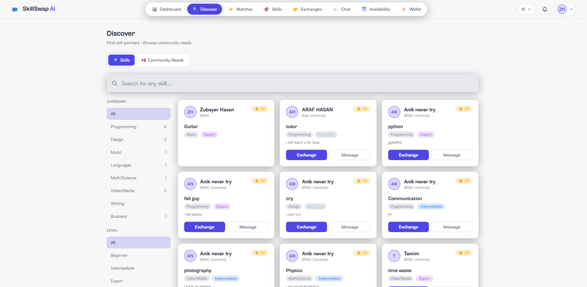
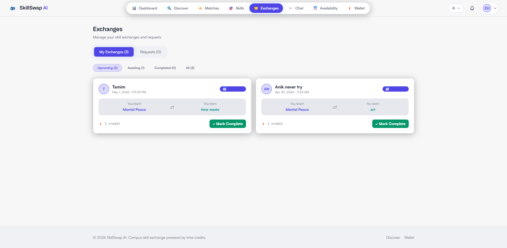
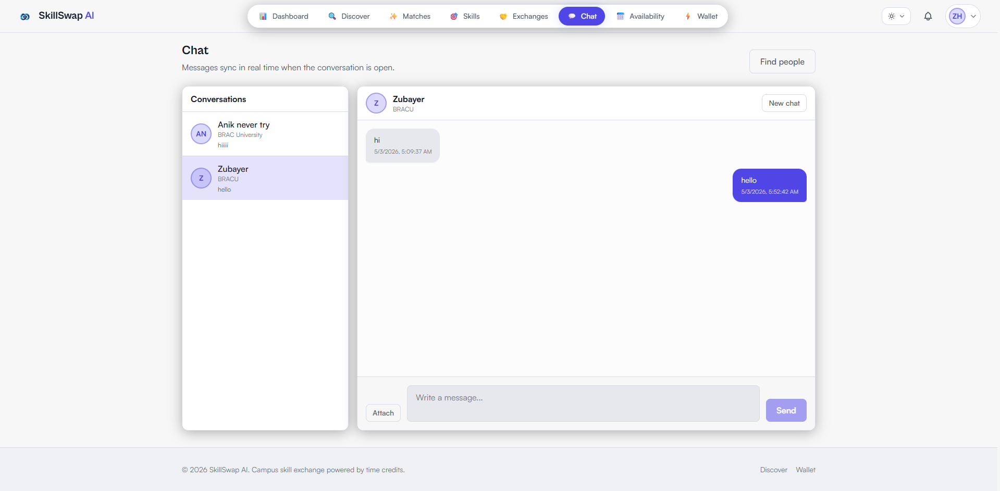
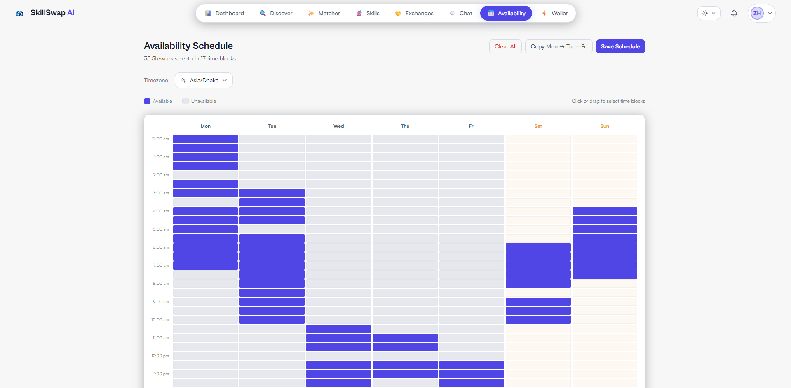
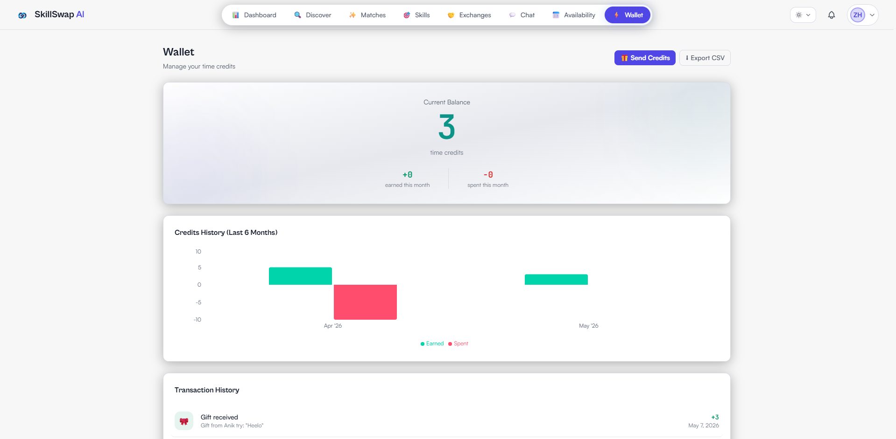
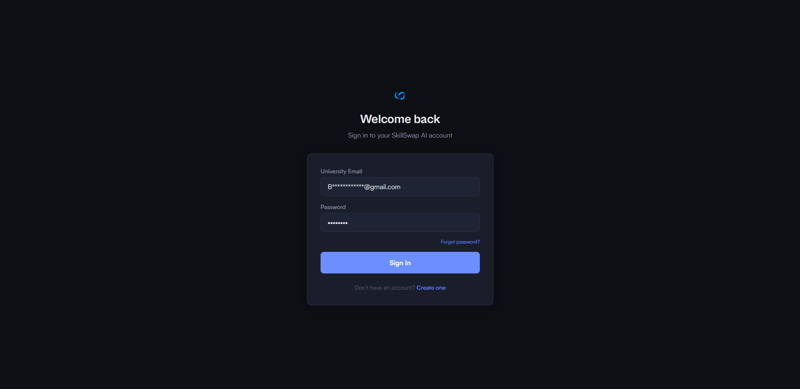

#  SkillSwap AI

**Exchange Skills. No Money Needed.**

A campus skill-barter platform where students trade expertise using time credits — teach what you know, learn what you need.


[🌐 Live Demo](https://skillswap-ai-project.vercel.app)

---

## 📸 Screenshots

#### GROUP 1 — Public pages (landing + auth)

<table>
<tr>
<td width="45%">

<br /><strong>Landing page (dark)</strong>
</td>
<td width="10%"></td>
<td width="45%">

<br /><strong>Login page (dark)</strong>
</td>
</tr>
</table>

#### GROUP 2 — Core app pages

<table>
<tr>
<td width="45%">

<br /><strong>Dashboard overview</strong>
</td>
<td width="10%"></td>
<td width="45%">

<br /><strong>Skill discovery with filters</strong>
</td>
</tr>
</table>

#### GROUP 3 — Matching and skills

<table>
<tr>
<td width="45%">

<br /><strong>Smart Match Dashboard</strong>
</td>
<td width="10%"></td>
<td width="45%">

<br /><strong>My Skills management</strong>
</td>
</tr>
</table>

#### GROUP 4 — Exchange economy

<table>
<tr>
<td width="45%">

<br /><strong>Exchanges with Mark Complete</strong>
</td>
<td width="10%"></td>
<td width="45%">

<br /><strong>Time-credit Wallet</strong>
</td>
</tr>
</table>

#### GROUP 5 — Communication and scheduling

<table>
<tr>
<td width="45%">

<br /><strong>Real-time Chat</strong>
</td>
<td width="10%"></td>
<td width="45%">

<br /><strong>Weekly Availability Schedule</strong>
</td>
</tr>
</table>

---

## ✨ Features

### 🔐 Authentication & Profiles
- Email verification with secure time-limited links
- JWT access tokens (15 min) + HttpOnly refresh tokens (7 days)
- Password reset via email
- Profile with bio, avatar, university, and availability schedule
- Profile completeness score (0–100%)
- Dark mode / Light mode toggle

### 🎯 Smart Matching Engine
- Weighted multi-factor algorithm: Mutual Reciprocity (40%), Skill Level Compatibility (25%), Trust Score (20%), Availability Overlap (15%)
- Pre-computed and cached match results (Redis, 6h TTL)
- Match score breakdown per candidate (Skill / Reciprocity / Availability / Quality chips)
- Skill discovery with full-text search, category, level, and trust score filters

### 🔄 Exchange Economy
- Exchange request → counter-proposal → accept/decline flow
- Dual-confirmation completion: credits transfer only after both parties confirm
- Atomic credit transfer via MongoDB multi-document transactions
- Immutable transaction ledger (no updates/deletes ever)
- 5 starter credits on signup
- Credit gifting/tipping between users
- CSV export of transaction history
- 48-hour dispute window after exchange completion

### 💬 Communication & Trust
- Real-time Socket.io chat (exchange partners only)
- Read receipts and message timestamps
- File attachments in chat
- In-app + email notifications for all platform events
- Trust Score (0–100) per user, computed from rating average, completion rate, response time, endorsements, and account age
- Post-exchange star ratings, reviews, and skill endorsements
- Drag-select weekly availability calendar with timezone support

---

## 🛠 Tech Stack

| Layer | Technology |
|-------|-----------|
| Frontend | React.js, Tailwind CSS, Redux Toolkit, React Query |
| Backend | Node.js, Express.js |
| Database | MongoDB Atlas (replica set for transactions) |
| Cache & Queues | Redis, Bull |
| Real-time | Socket.io |
| File Storage | Cloudinary |
| Auth | JWT (access + refresh), Email OTP via Nodemailer |
| Deployment | Vercel (client) |

---

## 🚀 Getting Started

### Prerequisites
- Node.js ≥ 18
- MongoDB Atlas cluster (replica set — required for transactions)
- Redis instance
- Cloudinary account
- SMTP credentials (Brevo/Sendinblue recommended)

### Installation

```bash
# 1. Clone the repository
git clone https://github.com/YOUR_USERNAME/skillswap-ai.git
cd skillswap-ai

# 2. Configure environment variables
cp .env.example server/.env
# Open server/.env and fill in all required values

# 3. Install server dependencies
cd server
npm install

# 4. Seed the skill taxonomy (required for matching to work)
npm run seed

# 5. Start the backend server
npm run dev
# → http://localhost:5000
# → Health check: http://localhost:5000/health

# 6. In a new terminal, install and start the client
cd ../client
npm install
npm run dev
# → http://localhost:5173
```

### (Optional) Run with Docker
```bash
# Starts Redis and MongoDB locally
docker-compose up -d
```

### (Optional) Promote a user to Admin
```bash
cd server
node scripts/makeAdmin.js --email="your@email.com"
```

---

## ⚙️ Environment Variables

Copy `.env.example` to `server/.env` and fill in:

| Variable | Required | Description |
|----------|----------|-------------|
| `MONGO_URI` | ✅ | MongoDB Atlas connection string (replica set) |
| `REDIS_URL` | ✅ | Redis connection URL |
| `JWT_ACCESS_SECRET` | ✅ | JWT signing secret (≥32 chars) |
| `JWT_REFRESH_SECRET` | ✅ | Refresh token secret (≥32 chars) |
| `SMTP_HOST` | ✅ | SMTP hostname (e.g. smtp-relay.brevo.com) |
| `SMTP_USER` | ✅ | SMTP username |
| `SMTP_PASS` | ✅ | SMTP password |
| `EMAIL_FROM` | ✅ | Sender email address |
| `CLOUDINARY_CLOUD_NAME` | ✅ | Cloudinary cloud name |
| `CLOUDINARY_API_KEY` | ✅ | Cloudinary API key |
| `CLOUDINARY_API_SECRET` | ✅ | Cloudinary API secret |
| `CLIENT_URL` | No | Frontend URL for CORS (default: localhost:5173) |

---

## 👥 Contributors

| Student ID | Name |
|------------|------|
| 22201826 | Md. Zubayer Hasan |
| 23101516 | Araf Hasan |
| 23101095 | Mariya Binta Mazhar |
| 22201484 | Sabah Maryam |
| 22299368 | Anik Rahman |

---

## 📄 License

Built as an academic project at BRAC University, 2026.
